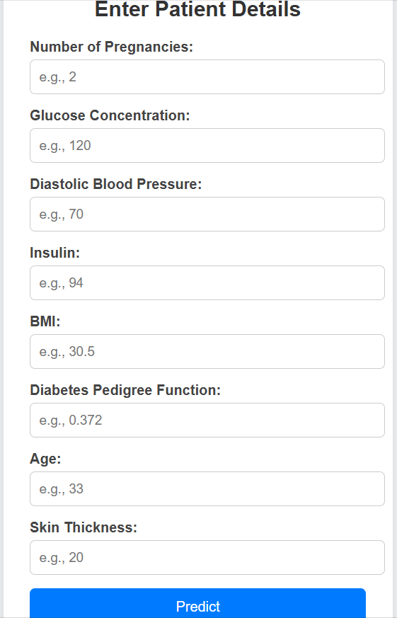
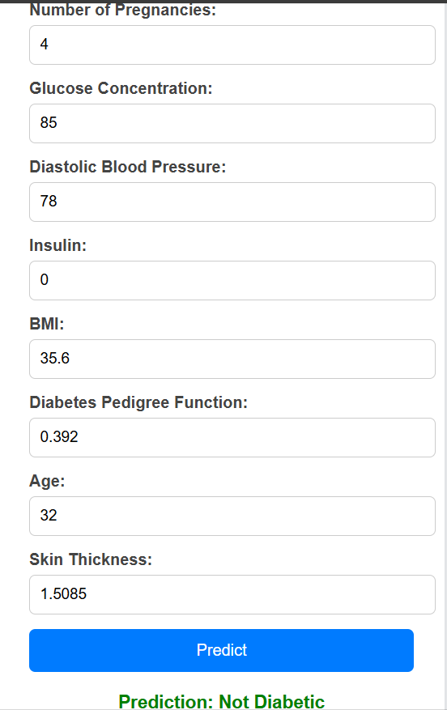

# 🩺 Diabetes Prediction using Machine Learning

## 📌 Project Overview

This is an end-to-end Machine Learning project that predicts whether a person is diabetic based on medical features.

The model is trained using the **Pima Indians Diabetes Dataset** and deployed as a web application using **Flask**.

This project demonstrates:
- Data preprocessing  
- Model training  
- Model evaluation  
- Model persistence  
- Web deployment  

---

## 🎯 Objective

To build a binary classification model that predicts diabetes risk using patient health data while ensuring good generalization and balanced performance.

---

## 🧠 Problem Type

**Supervised Learning – Classification**

Target Variable:
- `Outcome`
  - 0 → Non-Diabetic  
  - 1 → Diabetic  

---

## 📊 Dataset

**Dataset Used:**  
Pima Indians Diabetes Dataset  

- 768 rows  
- 8 medical features  

### Features:
- Pregnancies  
- Glucose  
- Blood Pressure  
- Skin Thickness  
- Insulin  
- BMI  
- Diabetes Pedigree Function  
- Age  

**Dataset Source:**  
https://www.kaggle.com/datasets/uciml/pima-indians-diabetes-database  

⚠️ Note: The dataset is not included in this repository due to licensing restrictions.

---

## 🛠️ Data Preprocessing

The following preprocessing steps were applied:

- Replaced invalid zero values with NaN  
- Applied mean imputation using `SimpleImputer`  
- Scaled features using `StandardScaler`  
- Train-test split (80% training, 20% testing)  

The preprocessing objects were saved separately to ensure consistent transformations during inference.

---

## 🤖 Model Used

**RandomForestClassifier**

### Why Random Forest?

- Handles non-linear relationships  
- Works well with structured medical data  
- Reduces overfitting using ensemble learning  

---

## 📏 Evaluation Metrics

- Accuracy  
- Confusion Matrix  
- Precision  
- Recall  

---

## 🏆 Model Performance

- Accuracy: ~75–80%  
- Balanced performance on both classes  
- No severe class bias observed  

---

## 🌐 Flask Deployment

The trained model is deployed using **Flask**.

To run locally:

```bash
pip install -r requirements.txt
python app.py
```

Open in browser:

```
http://127.0.0.1:5000
```

---

## 📸 Application Screenshots

### 🔹 Input Form Page



### 🔹 Prediction Result Page



---

## 💾 Model Persistence

The following objects are saved for inference:

- `rf_model.pkl`
- `scaler.pkl`
- `imputer.pkl`

⚠️ Important:  
The model requires the same preprocessing pipeline (imputation + scaling) before making predictions.

---

## 📂 Project Structure

```
diabetes-prediction-ml/
│
├── notebook/
│   └── diabetes_model_training.ipynb
│
├── model/
│   ├── rf_model.pkl
│   ├── scaler.pkl
│   └── imputer.pkl
│
├── assets/
│   ├── Input_Form_Page.png
│   └── Prediction_Result_Page.png
│
├── app.py
├── requirements.txt
├── README.md
└── .gitignore
```

---

## 🚀 Future Improvements

- Hyperparameter tuning using GridSearchCV  
- Probability score display  
- Model comparison with Logistic Regression / XGBoost  
- Cloud deployment (Render / Railway)  
- Add input validation  

---

## 📌 Conclusion

This project demonstrates:

- End-to-end ML workflow  
- Data preprocessing & handling invalid values  
- Model evaluation & generalization  
- Production-aware model saving  
- Flask-based deployment  

It highlights the importance of applying consistent preprocessing during inference and choosing appropriate models for structured medical datasets.
